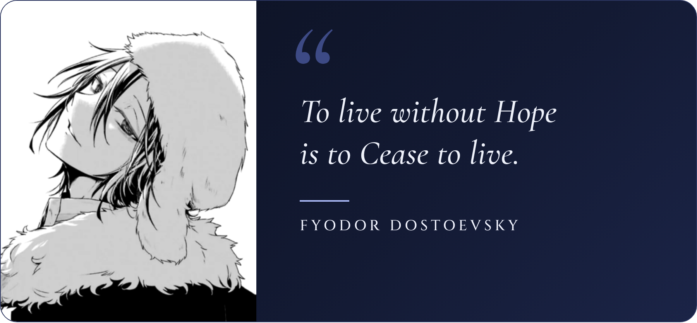

<h1>Hi, I'm Haikal Fikri Rabani</h1>

Statistics graduate from **Universitas Indonesia**, working toward becoming a **Data Scientist**. Currently an **IT & Digital Risk Analyst at Bank Rakyat Indonesia (BRI)**, based in South Tangerang, Indonesia.

  
  
  
  
  
  

 

- Interested in data analysis, machine learning, deep learning, and business intelligence
- B.Sc. in Statistics, Universitas Indonesia (2022–2026) · GPA 3.54/4.00
- BNSP-certified Associate Data Scientist

## ◆ Featured projects

### [Sales Dashboard](https://github.com/haikalfr04/Sales-Dashboard) · [Live demo](https://haikalfr04.github.io/Sales-Dashboard/)
An interactive BI-style dashboard for a fictional Indonesian retailer, built from about 26,000 transactions (2023–2025). It has five pages (overview, products, customers, regional map, raw data), cross-filtering by clicking charts, period-over-period comparison, monthly targets, shareable filtered links, and light/dark mode.
`JavaScript` `HTML` `Business Intelligence`

### [Movie Review Sentiment Analysis](https://github.com/haikalfr04/Sentiment-Analysis)
Classifies IMDB reviews by comparing TF-IDF + Logistic Regression against fine-tuned DistilBERT and RoBERTa. **RoBERTa-base reached 95.67% accuracy** on 25,000 test reviews and made 55% fewer errors than the baseline. Keeping both the beginning and the end of long reviews raised DistilBERT's accuracy by 1.4 points at no extra cost.
`Python` `PyTorch` `Transformers` `NLP`

### [IDX Stock Return Prediction](https://github.com/haikalfr04/Stocks-Prediction)
Predicts next-day returns of ASII, BBRI, and TLKM for Jan–Sep 2026 using Ridge and LightGBM, compared against random-walk, historical-mean, and momentum baselines. Each strategy is backtested after IDX fees and checked with a luck (shift) test. The result is honest: no model beat chance on daily direction, which shows why naive price charts can look misleadingly accurate.
`Python` `LightGBM` `scikit-learn` `Time Series`

### [Product Clustering](https://github.com/haikalfr04/Clustering)
Groups 35,311 e-commerce products from the PriceRunner dataset with K-Means. The number of clusters was chosen with the Elbow Method and Silhouette Score (best k = 7, score 0.58), and the clusters are visualized with PCA.
`Python` `scikit-learn` `Unsupervised Learning`

## ◆ Experience

| Role | Company | Period |
| --- | --- | --- |
| **IT & Digital Risk Analyst** | PT Bank Rakyat Indonesia (Persero) Tbk | Sep 2026 – Present |
| **Service Analyst** (Intern) | Asuransi Astra | Feb 2026 – Aug 2026 |
| **Data Analyst** (Intern) | AnyMind Group | May 2025 – Dec 2025 |
| **Survey Development Analyst** (Intern) | Badan Pusat Statistik (BPS) | Dec 2024 – Feb 2025 |

Highlights

- **Asuransi Astra:** Analyzed customer satisfaction, branch service performance, and queue/service-duration data. Built integrated SLA and service reports in Excel and PowerPoint, and initiated a Python- and HTML-based automation that cut repetitive reporting work.
- **AnyMind Group:** Automated cross-platform campaign data (Instagram, TikTok, X, YouTube). Delivered 30+ KOL campaign analysis decks for 15+ brands and agencies, and built an end-to-end KPI dashboard in Looker Studio.
- **BPS:** Refined survey variables for SUSENAS and the Economic Census using Excel, SPSS, and R. Also did spatial analysis and applied regression and forecasting to survey and weather data.

## ◆ Thesis

**Development of a Joint Document-Level Sentiment-Topic Model Based on Extended Long Short-Term Memory (xLSTM) for Sentiment Analysis**
A multi-task model that learns sentiment and topics at the same time. A shared xLSTM encoder, pre-trained as an autoencoder, feeds both a sentiment classifier and a Deep Embedded K-Means topic detector. Every xLSTM configuration outperformed the LSTM baselines, reaching **88.75% accuracy on IMDB** and **92.01% on Yelp**, and it produced the most coherent topics on IMDB.

## ◆ Skills & tools

**Data & programming**

**Dashboards & BI**

**Web**

**Productivity & design**

**Focus areas:** Data Analysis · Market Research · AI/ML · Deep Learning · Business Intelligence

## ◆ Certifications

- **Associate Data Scientist**, Badan Nasional Sertifikasi Profesi (BNSP) · 2025–2028
- **Data Analysis Fullstack Intensive Bootcamp**, MySkill · 2024
- **TOEFL ITP**, Englishvit · Score 527 · 2026

  

## ◆ GitHub stats

